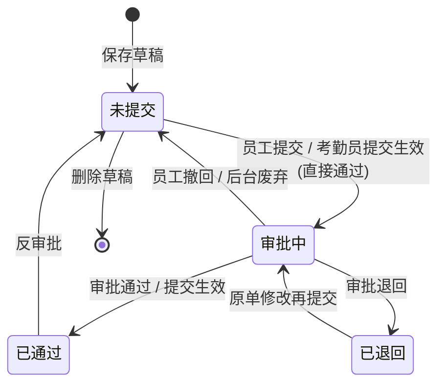

# 补签卡功能测试用例

## 文档说明

| 项目 | 内容 |
| --- | --- |
| 文档版本 | V1.0 |
| 编写日期 | 2026-06-03 |
| 测试范围 | 2.3.6 [我的假勤] 我要补签；3.2.2.10 审批中心（补签卡审批）；3.2.2.4 考勤单据-补签卡管理 |
| 需求依据 | `考勤总需求文档.md` |
| 接口依据 | `接口文档/补签卡.md` |
| 优先级说明 | P0=阻塞发布；P1=核心功能；P2=一般功能；P3=边界/体验 |

### 接口完成状态（影响测试范围）

| 接口 | 路径 | 状态 |
| --- | --- | --- |
| 补签申请初始化 | `POST /api/supplement/request/self/init` | 已完成 |
| 保存补签草稿/提交 | `POST /api/supplement/request/self/save` | 已完成 |
| 我的补签列表分页 | `POST /api/supplement/request/self/page` | 已完成 |
| 补签详情（统一入口） | `POST /api/supplement/request/admin/detail` | 已完成 |
| 删除补签草稿 | `POST /api/supplement/request/self/delete` | 已完成 |
| 员工端废弃/撤回 | `POST /api/supplement/request/self/abandon` | 已完成 |
| 后台列表分页 | `POST /api/supplement/request/admin/page` | 已完成 |
| 提交生效 | `POST /api/supplement/request/admin/direct-pass` | **未完成** |
| 反审批 | `POST /api/supplement/request/admin/reverse-approve` | **未完成** |
| 后台废弃 | `POST /api/supplement/request/admin/abandon` | **未完成** |
| 导出 | `POST /api/supplement/request/admin/export` | **未完成** |
| 缺卡检查分页 | `POST /api/supplement/request/admin/missing/page` | **未完成** |
| 缺卡批量生成补签卡 | `POST /api/supplement/request/admin/missing/generate` | **未完成** |

### 测试数据准备

| 数据项 | 说明 |
| --- | --- |
| 在职员工 A | 有有效考勤档案，用于正常发起补签 |
| 在职员工 B | 部门负责人，用于审批补签任务 |
| 考勤员 C | 负责 A 所在部门，可进入补签卡管理与审批中心 |
| HR D | 负责 A 所在部门，可查看不可处理（按角色定义） |
| 普通员工 E | 无后台权限，仅员工自助端 |
| 离职/无档案员工 F | 用于初始化 `canApply=false` 场景 |
| 补签原因-允许提前 | `allowAdvance=true`，如外出公干 |
| 补签原因-不允许提前 | `allowAdvance=false`，如忘记打卡 |
| 已有缺卡记录 | 考勤计算后存在缺卡时间点，且未被请假/出差/加班覆盖 |
| 已审批通过出差/加班单 | 覆盖时段不应出现在缺卡检查结果 |

### 测试账号角色矩阵

| 角色 | 我要补签 | 审批中心（补签） | 补签卡管理 |
| --- | --- | --- | --- |
| 普通员工 | 可见可写（本人） | 不可见 | 不可见 |
| 部门负责人 | 可见可写（本人） | 可见可审批（分配任务） | 可见只读 |
| 考勤员 | 可见可写（本人） | 可见可审批/调整审核人 | 可见可写 |
| HR | 可见可写（本人） | 不可见 | 可见只读 |
| 系统管理员 | 不可见 | 可见只读 | 可见只读 |

---

## 一、[我的假勤] 我要补签（2.3.6）

### 1.1 页面展示与初始化

| 用例编号 | 用例名称 | 前置条件 | 测试步骤 | 预期结果 | 优先级 | 关联接口 | 是否完成 | 备注 |
| --- | --- | --- | --- | --- | --- | --- | --- | --- |
| BQ-SELF-001 | 补签申请页顶部按钮展示 | 在职员工 A 登录 | 1. 进入「我的假勤 → 我要补签」 | 顶部展示「保存」「提交」「补签卡列表」三个按钮 | P0 | — |  |  |
| BQ-SELF-002 | 基础信息自动填充 | 在职员工 A 登录 | 1. 进入补签申请页 | 自动展示员工编码、姓名、职位、组织 | P0 | `/self/init` |  |  |
| BQ-SELF-003 | 补签类型下拉数据 | 在职员工 A 登录 | 1. 进入补签申请页 2. 查看补签卡类型 | 类型固定为 `REPAIR_CARD/补卡`，支持下拉或弹窗选择 | P1 | `/self/init` |  |  |
| BQ-SELF-004 | 补签原因下拉数据 | 后台已配置启用原因 | 1. 进入补签申请页 2. 查看补签卡原因 | 展示已启用原因列表（含 reasonCode、reasonName）；未启用原因不可选 | P0 | `/self/init` |  |  |
| BQ-SELF-005 | 非在职员工禁止申请 | 员工 F 非在职 | 1. 调用 init 或进入申请页 | `canApply=false`，展示 `disabledReason`（非在职）；保存/提交不可用 | P0 | `/self/init` |  |  |
| BQ-SELF-006 | 无考勤档案禁止申请 | 员工无有效考勤档案 | 1. 进入补签申请页 | `canApply=false`，展示不允许原因；不可保存/提交 | P0 | `/self/init` |  |  |
| BQ-SELF-007 | HR 代他人发起权限校验 | HR D 登录，talentCode 传权限外员工 | 1. init 传入权限外 talentCode | 接口拒绝或前端提示无权限 | P1 | `/self/init` |  |  |
| BQ-SELF-008 | HR 代权限内员工发起 | HR D 登录，talentCode 传权限内员工 | 1. init 传入权限内 talentCode | 返回该员工基础信息与可选项，`canApply` 按该员工状态判断 | P2 | `/self/init` |  |  |

### 1.2 补签卡信息录入

| 用例编号 | 用例名称 | 前置条件 | 测试步骤 | 预期结果 | 优先级 | 关联接口 | 是否完成 | 备注 |
| --- | --- | --- | --- | --- | --- | --- | --- | --- |
| BQ-SELF-010 | 单条补签子项录入 | 在职员工 A | 1. 填写考勤日期/时间点 2. 选择补签类型、原因 3. 填写备注 | 各字段可正常录入；时间点精确到分钟 | P0 | — |  |  |
| BQ-SELF-011 | 新增多条补签子项 | 在职员工 A | 1. 点击「+」新增子项 2. 分别填写不同时间点 | 可在一个补签单中录入多条子项；每条独立展示类型、原因、备注 | P0 | — |  |  |
| BQ-SELF-012 | 删除补签子项 | 已新增 ≥2 条子项 | 1. 点击「x」删除其中一条 | 对应子项被移除；至少保留一条或可全部删除后提示 | P1 | — |  |  |
| BQ-SELF-013 | 补签时间分钟档位 | 在职员工 A | 1. 选择补签时间点 | 分钟仅可选 `00/15/30/45` 四档（与后台管理口径一致） | P1 | — |  |  |
| BQ-SELF-014 | 必填项校验-时间为空 | 在职员工 A | 1. 不填时间直接保存 | 提示考勤日期/时间点必填 | P0 | `/self/save` |  |  |
| BQ-SELF-015 | 必填项校验-原因为空 | 在职员工 A | 1. 填时间不选原因直接保存 | 提示补签卡原因必填 | P0 | `/self/save` |  |  |
| BQ-SELF-016 | 时间格式校验 | 在职员工 A | 1. 传入非法时间格式 | 接口返回格式错误提示 | P1 | `/self/save` |  |  |
| BQ-SELF-017 | 原因必须从配置选择 | 在职员工 A | 1. 尝试手工输入未配置原因 | 不允许自由录入，仅可选择下拉/弹窗项 | P1 | — |  |  |
| BQ-SELF-018 | 附件上传（如有） | 在职员工 A | 1. 上传附件并保存 | `attachmentIds` 正确传递；详情页可查看附件 | P2 | `/self/save` |  |  |

### 1.3 保存草稿与提交审批

| 用例编号 | 用例名称 | 前置条件 | 测试步骤 | 预期结果 | 优先级 | 关联接口 | 是否完成 | 备注 |
| --- | --- | --- | --- | --- | --- | --- | --- | --- |
| BQ-SELF-020 | 保存草稿 | 填写完整子项 | 1. 点击「保存」 | 单据状态为「未提交」；返回 `saved=true`、`submitted=false`；生成正式单号 | P0 | `/self/save` |  |  |
| BQ-SELF-021 | 提交确认弹窗 | 填写完整子项 | 1. 点击「提交」 | 弹出确认弹窗；取消则不提交 | P0 | — |  |  |
| BQ-SELF-022 | 提交审批成功 | 填写完整子项 | 1. 点击「提交」并确认 | 状态变为「审批中」；返回 `submitted=true`；生成 `approvalInstanceId`、`taskId`；审批中心出现补签任务 | P0 | `/self/save` |  |  |
| BQ-SELF-023 | 重复补签时间拦截 | 员工 A 已有同时间点补签单 | 1. 再次对同一 `attendanceDateTime` 保存/提交 | 提示同一员工同一补签时间不允许重复 | P0 | `/self/save` |  |  |
| BQ-SELF-024 | 修改时排除自身重复校验 | 未提交单据编辑 | 1. 修改其他字段但不改时间 2. 保存 | 不因自身重复而被拦截 | P1 | `/self/save` |  |  |
| BQ-SELF-025 | 不允许提前补签 | 选择 `allowAdvance=false` 原因 | 1. 补签时间选未来日期 2. 提交 | 提交失败，提示不允许提前补签 | P0 | `/self/save` |  |  |
| BQ-SELF-026 | 允许提前补签 | 选择 `allowAdvance=true` 原因 | 1. 补签时间选未来日期 2. 提交 | 允许提交（若业务上存在合理未来场景） | P1 | `/self/save` |  |  |
| BQ-SELF-027 | 编辑未提交草稿 | 存在未提交单据 | 1. 从列表进入编辑 2. 修改后保存 | 允许修改；旧明细逻辑删除后插入新明细 | P0 | `/self/save` |  |  |
| BQ-SELF-028 | 编辑已退回单据 | 存在已退回单据 | 1. 修改后保存 | 允许修改；清空 `submit_time`/`approve_time`；禁用旧审批绑定 | P0 | `/self/save` |  |  |
| BQ-SELF-029 | 编辑审批中单据 | 存在审批中单据 | 1. 尝试编辑保存 | 不允许修改或保存失败 | P0 | `/self/save` |  |  |
| BQ-SELF-030 | 审批中单据重复提交 | 存在审批中单据 | 1. `actionType=submit` 再次提交 | 审批服务拦截重复提交 | P0 | `/self/save` |  |  |
| BQ-SELF-031 | 保存/提交不改打卡记录 | 提交成功 | 1. 查看打卡记录与考勤计算 | 原始打卡记录未被篡改；不触发考勤计算 | P1 | `/self/save` |  |  |
| BQ-SELF-032 | 单号生成规则 | 新增保存 | 1. 保存后查看单号 | 正式单号符合 `BQKD + yyyyMMddHHmmssSSS + 3位序号` | P2 | `/self/save` |  |  |

### 1.4 补签卡列表（员工端）

| 用例编号 | 用例名称 | 前置条件 | 测试步骤 | 预期结果 | 优先级 | 关联接口 | 是否完成 | 备注 |
| --- | --- | --- | --- | --- | --- | --- | --- | --- |
| BQ-SELF-040 | 进入补签卡列表 | 员工 A 有草稿和已提交单 | 1. 点击「补签卡列表」 | 进入列表页；同时展示草稿与已提交单据 | P0 | `/self/page` |  |  |
| BQ-SELF-041 | 列表字段展示 | 员工 A 有多条单据 | 1. 查看列表列 | 展示单据编号、员工姓名、考勤日期、补签类型、补签时间点、补签原因、单据状态、审批人、备注 | P0 | `/self/page` |  |  |
| BQ-SELF-042 | 列表排序 | 员工 A 有多条单据 | 1. 查看列表顺序 | 按申请日期倒序 | P1 | `/self/page` |  |  |
| BQ-SELF-043 | 仅展示本人单据 | 员工 A 登录 | 1. 查看列表 | 不出现其他员工补签单 | P0 | `/self/page` |  |  |
| BQ-SELF-044 | 双击进入详情 | 列表有记录 | 1. 双击某条记录 | 进入补签详情页 | P0 | — |  |  |
| BQ-SELF-045 | 删除未提交草稿 | 存在未提交单据 | 1. 选择删除 | 删除成功；列表不再展示 | P0 | `/self/delete` |  |  |
| BQ-SELF-046 | 删除非未提交单据 | 存在审批中/已通过单据 | 1. 尝试删除 | 不允许删除并提示 | P0 | `/self/delete` |  |  |
| BQ-SELF-047 | 员工端废弃审批中单据 | 审批中且无人审批 | 1. 执行废弃/撤回 | 状态改为「未提交」；审批实例「已撤回」；待办任务关闭 | P0 | `/self/abandon` |  |  |
| BQ-SELF-048 | 已有人审批不可撤回 | 审批中且已有同意/退回 | 1. 执行废弃/撤回 | 失败并提示 | P0 | `/self/abandon` |  |  |
| BQ-SELF-049 | 已通过不可员工撤回 | 已通过单据 | 1. 执行废弃/撤回 | 不允许 | P1 | `/self/abandon` |  |  |
| BQ-SELF-050 | 未提交请用删除 | 未提交草稿 | 1. 执行废弃/撤回 | 提示请使用删除功能 | P2 | `/self/abandon` |  |  |
| BQ-SELF-051 | 批量撤回上限 | 准备 101 条可撤回单据 | 1. 批量撤回 | 超过 100 条限制，整体失败回滚 | P2 | `/self/abandon` |  |  |

### 1.5 补签详情（员工端）

| 用例编号 | 用例名称 | 前置条件 | 测试步骤 | 预期结果 | 优先级 | 关联接口 | 是否完成 | 备注 |
| --- | --- | --- | --- | --- | --- | --- | --- | --- |
| BQ-SELF-060 | 详情基础信息展示 | 任意状态单据 | 1. 进入详情页 | 展示单号、员工信息、补签类型、申请/提交时间、明细列表 | P0 | `/admin/detail` |  |  |
| BQ-SELF-061 | 审批状态与意见同页展示 | 已提交单据 | 1. 进入详情页 | 直接展示审批状态、审批意见、流程信息；无需单独审批意见页 | P0 | `/admin/detail` |  |  |
| BQ-SELF-062 | 明细生效状态 | 已通过单据 | 1. 查看 details | 展示 `effectStatus`（未生效/已生效/已回滚）及关联打卡记录 ID | P1 | `/admin/detail` |  |  |
| BQ-SELF-063 | 按钮权限-可编辑 | 本人+未提交/已退回 | 1. 查看详情操作区 | `canEdit=true`、`canSubmit=true` | P0 | `/admin/detail` |  |  |
| BQ-SELF-064 | 按钮权限-可删除 | 本人+未提交 | 1. 查看详情 | `canDelete=true` | P0 | `/admin/detail` |  |  |
| BQ-SELF-065 | 按钮权限-可撤回 | 本人+审批中+无人处理 | 1. 查看详情 | `canAbandon=true` | P1 | `/admin/detail` |  |  |
| BQ-SELF-066 | 非本人不可操作 | 员工 E 查看 A 的单据 ID | 1. 直接访问详情 | 无编辑/删除/提交/撤回权限 | P0 | `/admin/detail` |  |  |

### 1.6 异常入口联动

| 用例编号 | 用例名称 | 前置条件 | 测试步骤 | 预期结果 | 优先级 | 关联接口 | 是否完成 | 备注 |
| --- | --- | --- | --- | --- | --- | --- | --- | --- |
| BQ-SELF-070 | 考勤日历异常入口 | 某日存在考勤异常 | 1. 日历右侧点击「我要补签」 | 进入补签申请页；默认带入异常日期/时间点 | P0 | `/self/init?sourceType=calendar` |  |  |
| BQ-SELF-071 | 打卡记录异常入口 | 打卡记录存在异常 | 1. 从打卡记录发起补签 | 带入对应 `sourceDateTime`；`sourceType=punch_record` | P0 | `/self/init` |  |  |
| BQ-SELF-072 | 缺卡检查批量补签入口 | 缺卡检查勾选记录 | 1. 批量补签后进入申请 | 带入缺卡时间点；`sourceType=missing_check` | P1 | `/self/init` |  |  |
| BQ-SELF-073 | 审批通过后不改原始打卡 | 补签审批通过 | 1. 查看原始打卡记录 | 原始记录保持真实；异常处理结果/考勤计算按规则更新 | P0 | — |  |  |

---

## 二、审批中心 - 补签申请（3.2.2.10）

> 补签卡提交后进入审批中心；流程默认：`呈批 → 部门负责人审核（组长审核） → 完成`，多审核人或签。

### 2.1 任务生成与列表

| 用例编号 | 用例名称 | 前置条件 | 测试步骤 | 预期结果 | 优先级 | 关联需求 | 是否完成 | 备注 |
| --- | --- | --- | --- | --- | --- | --- | --- | --- |
| BQ-APPR-001 | 员工提交生成待办 | 员工 A 提交补签 | 1. 部门负责人 B 进入审批中心「待审批」 | 出现补签卡任务；流程主题含单据类型与编号 | P0 | 3.2.2.10.7-1 |  |  |
| BQ-APPR-002 | 提交生效直接通过 | 考勤员对未提交单执行提交生效 | 1. 查看审批中心「全部」 | 生成补签任务且状态直接为「审批通过」；不进入待办 | P0 | 3.2.2.4.8-5 |  |  |
| BQ-APPR-003 | 全部标签页范围 | 考勤员 C 登录 | 1. 切换「全部」 | 展示权限范围内全部补签任务（含已处理） | P1 | 3.2.2.10.7-3 |  |  |
| BQ-APPR-004 | 待审批标签页范围 | 部门负责人 B | 1. 切换「待审批」 | 仅展示当前处理人为 B 的补签任务 | P0 | 3.2.2.10.7-4 |  |  |
| BQ-APPR-005 | 我的申请标签页 | 员工 A 提交后 | 1. A 不可进后台；B 代查「我的申请」不适用员工 | 后台「我的申请」仅展示本人发起且处理中任务（考勤员代提场景按实际账号验证） | P2 | 3.2.2.10.7-5 |  |  |
| BQ-APPR-006 | 列表字段展示 | 有待办任务 | 1. 查看任务列表 | 展示流程主题、状态、当前处理人、任务到达时间、任务运行时间 | P1 | 3.2.2.10.5 |  |  |
| BQ-APPR-007 | 关键字搜索 | 多条补签任务 | 1. 输入单号关键字搜索 | 返回匹配任务；名称类模糊匹配 | P2 | 3.2.2.10.7-6 |  |  |
| BQ-APPR-008 | 高级筛选 | 多条补签任务 | 1. 点击「筛选」组合条件 | 按列表字段精确/区间筛选 | P2 | 3.2.2.10.7-7 |  |  |
| BQ-APPR-009 | 普通员工不可进审批中心 | 员工 E 登录 | 1. 尝试访问审批中心 | 无入口或无权访问 | P0 | 3.2.2.10.2 |  |  |

### 2.2 审批处理

| 用例编号 | 用例名称 | 前置条件 | 测试步骤 | 预期结果 | 优先级 | 关联需求 | 是否完成 | 备注 |
| --- | --- | --- | --- | --- | --- | --- | --- | --- |
| BQ-APPR-020 | 双击进入补签详情 | 待审批补签任务 | 1. 双击任务 | 进入详情；展示补签单信息与任务流程列表 | P0 | 3.2.2.10.7-8 |  |  |
| BQ-APPR-021 | 待审批详情展示通过/退回 | 当前处理人为 B | 1. 进入待审批详情 | 展示「通过」「退回」按钮 | P0 | 3.2.2.10.4-8 |  |  |
| BQ-APPR-022 | 审批通过 | 待审批补签任务 | 1. 填写处理意见 2. 点击通过 | 任务状态更新；补签单状态「已通过」；任务移出 B 的待审批 | P0 | 3.2.2.10.9 |  |  |
| BQ-APPR-023 | 审批退回 | 待审批补签任务 | 1. 填写处理意见 2. 点击退回 | 补签单状态「已退回」；申请人可在原单修改再提交，不新建单 | P0 | 3.2.2.10.8-12 |  |  |
| BQ-APPR-024 | 非当前处理人不可审批 | 任务处理人为 B | 1. 考勤员 C（非当前处理人）尝试审批 | 无通过/退回权限或操作失败 | P0 | 3.2.2.10.9-3 |  |  |
| BQ-APPR-025 | 或签任一审核人处理 | 节点配置多人 | 1. 审核人 1 通过 | 流程流转；审核人 2 待办关闭 | P1 | 3.2.3.3.8-6 |  |  |
| BQ-APPR-026 | 退回后原单再提交 | 已退回单据 | 1. A 修改原单提交 | 同一 `supplementRequestId` 再次进入审批；不生成新单据 | P0 | 3.2.2.10.9-9 |  |  |
| BQ-APPR-027 | 审批通过后考勤影响 | 补签审批通过 | 1. 查看考勤异常/计算结果 | 异常处理结果更新；原始打卡不被覆盖 | P0 | 2.3.6.9-11 |  |  |

### 2.3 转签与调整审核人

| 用例编号 | 用例名称 | 前置条件 | 测试步骤 | 预期结果 | 优先级 | 关联需求 | 是否完成 | 备注 |
| --- | --- | --- | --- | --- | --- | --- | --- | --- |
| BQ-APPR-030 | 任务权限转交入口 | 待审批页有补签任务 | 1. 点击「任务权限转交」 | 弹出转签弹窗；含业务种类、转交人等字段 | P1 | 3.2.2.10.4-10 |  |  |
| BQ-APPR-031 | 转签成功刷新列表 | 有效转签参数 | 1. 确定转交 | 任务处理人变更；待审批/全部/我的申请数据刷新 | P1 | 3.2.2.10.7-14 |  |  |
| BQ-APPR-032 | 调整审核人-考勤员可见 | 审批中补签任务 | 1. 考勤员 C 打开详情 | 展示「调整审核人」按钮 | P1 | 3.2.2.10.4-12 |  |  |
| BQ-APPR-033 | 调整审核人-非考勤员不可见 | 审批中补签任务 | 1. 部门负责人 B 打开详情 | 不展示「调整审核人」 | P1 | 3.2.2.10.10-15 |  |  |
| BQ-APPR-034 | 调整审核人仅影响当前单 | 调整成功 | 1. 查看同流程其他单据 | 其他单据审核人不变；后续新任务不受影响 | P2 | 3.2.2.10.8-19 |  |  |

### 2.4 导出（审批中心）

| 用例编号 | 用例名称 | 前置条件 | 测试步骤 | 预期结果 | 优先级 | 关联需求 | 是否完成 | 备注 |
| --- | --- | --- | --- | --- | --- | --- | --- | --- |
| BQ-APPR-040 | 导出当前筛选结果 | 有筛选条件 | 1. 点击导出 | 导出与当前筛选一致的补签任务 | P2 | 3.2.2.10.8-11 |  |  |
| BQ-APPR-041 | 导出选中记录 | 勾选部分任务 | 1. 导出选中 | 仅导出勾选任务 | P2 | 3.2.2.10.8-11 |  |  |

---

## 三、考勤单据 - 补签卡管理（3.2.2.4）

### 3.1 列表与高级搜索

| 用例编号 | 用例名称 | 前置条件 | 测试步骤 | 预期结果 | 优先级 | 关联接口 | 是否完成 | 备注 |
| --- | --- | --- | --- | --- | --- | --- | --- | --- |
| BQ-ADM-001 | 考勤员进入列表 | 考勤员 C 登录 | 1. 进入「考勤单据-补签卡管理」 | 正常展示权限范围内补签卡列表 | P0 | `/admin/page` |  |  |
| BQ-ADM-002 | 普通员工不可进入 | 员工 E 登录 | 1. 尝试访问 | 无入口或无权 | P0 | — |  |  |
| BQ-ADM-003 | 普通员工接口空列表 | 员工 E 调 admin/page | 1. 直接调接口 | selfOnly 返回空列表 | P1 | `/admin/page` |  |  |
| BQ-ADM-004 | 列表字段展示 | 有多条数据 | 1. 查看列 | 含单据编号、组织、员工编码、姓名、考勤日期、原因编码、时间点、原因、状态、办理人、审批人、备注；不展示「补卡类型」 | P0 | — |  |  |
| BQ-ADM-005 | 高级搜索-单号 | 已知单号 | 1. 输入单据编号查询 | 模糊匹配返回 | P1 | `/admin/page` |  |  |
| BQ-ADM-006 | 高级搜索-组织 | 选择父部门 | 1. 选组织查询 | 展开子部门并与数据权限取交集 | P0 | `/admin/page` |  |  |
| BQ-ADM-007 | 高级搜索-姓名 | 输入姓名 | 1. 模糊查询 | 返回匹配员工补签单 | P1 | `/admin/page` |  |  |
| BQ-ADM-008 | 高级搜索-日期范围 | 设置 startDate/endDate | 1. 按补签时间筛选 | 按明细 attendance_datetime 过滤；endDate 含当天 | P0 | `/admin/page` |  |  |
| BQ-ADM-009 | 高级搜索-状态 | 选「审批中」 | 1. 查询 | 仅返回对应状态单据 | P1 | `/admin/page` |  |  |
| BQ-ADM-010 | 列表排序 | 多条已提交单 | 1. 查看默认排序 | submit_time DESC, create_time DESC | P2 | `/admin/page` |  |  |
| BQ-ADM-011 | 分页 pageSize 上限 | pageSize=500 | 1. 查询 | 实际最大 200 条/页 | P2 | `/admin/page` |  |  |
| BQ-ADM-012 | 行内按钮权限 | 不同状态单据 | 1. 查看 canDirectPass/canReverseApprove 等 | 与角色+状态匹配：考勤员+未提交/已退回可提交生效；+已通过可反审批 | P1 | `/admin/page` |  |  |
| BQ-ADM-013 | 系统管理员只读 | 管理员登录 | 1. 查看工具栏 | 可查看列表，不可执行后台处理（按角色表） | P1 | 3.2.2.4.2 |  |  |
| BQ-ADM-014 | HR 只读 | HR D 登录 | 1. 查看负责范围内列表 | 可查看不可写 | P1 | 3.2.2.4.2 |  |  |

### 3.2 提交生效

| 用例编号 | 用例名称 | 前置条件 | 测试步骤 | 预期结果 | 优先级 | 关联接口 | 是否完成 | 备注 |
| --- | --- | --- | --- | --- | --- | --- | --- | --- |
| BQ-ADM-020 | 选中未提交单提交生效 | 未提交/已退回单 | 1. 勾选 2. 点击「提交生效」 | 状态直接「审批通过」；审批中心有记录但不进待办 | P0 | `/admin/direct-pass` ⚠️ |  |  |
| BQ-ADM-021 | 非考勤员不可提交生效 | 部门负责人 B | 1. 尝试提交生效 | 无权限或按钮不可用 | P0 | — |  |  |
| BQ-ADM-022 | 审批中/已通过不可提交生效 | 审批中或已通过 | 1. 尝试提交生效 | 操作被拒绝 | P1 | `/admin/direct-pass` ⚠️ |  |  |

### 3.3 反审批与废弃

| 用例编号 | 用例名称 | 前置条件 | 测试步骤 | 预期结果 | 优先级 | 关联接口 | 是否完成 | 备注 |
| --- | --- | --- | --- | --- | --- | --- | --- | --- |
| BQ-ADM-030 | 反审批-已通过且部门负责人已审 | 符合条件单据 | 1. 勾选 2. 点击「反审批」 | 单据退回呈批人、恢复「未提交」；删除打卡记录表中补签记录 | P0 | `/admin/reverse-approve` ⚠️ |  |  |
| BQ-ADM-031 | 反审批-非已通过 | 审批中/未提交 | 1. 尝试反审批 | 不允许 | P1 | — |  |  |
| BQ-ADM-032 | 废弃-部门负责人审批中 | 部门负责人审批中 | 1. 勾选 2. 点击「废弃」 | 退回呈批人、恢复「未提交」 | P0 | `/admin/abandon` ⚠️ |  |  |
| BQ-ADM-033 | 废弃-非审批中 | 未提交/已通过 | 1. 尝试废弃 | 不允许 | P1 | — |  |  |
| BQ-ADM-034 | 员工端与后台废弃差异 | 审批中单 | 1. 员工端 abandon vs 后台 abandon | 员工端：本人撤回；后台：考勤员废弃（canAbandon 后台固定 false） | P1 | — |  |  |

### 3.4 导出

| 用例编号 | 用例名称 | 前置条件 | 测试步骤 | 预期结果 | 优先级 | 关联接口 | 是否完成 | 备注 |
| --- | --- | --- | --- | --- | --- | --- | --- | --- |
| BQ-ADM-040 | 导出选中 | 勾选多条 | 1. 点击「导出选中」 | 导出勾选记录，字段与列表一致 | P1 | `/admin/export` ⚠️ |  |  |
| BQ-ADM-041 | 导出全部 | 有筛选条件 | 1. 点击「导出全部」 | 导出当前过滤结果全集 | P1 | `/admin/export` ⚠️ |  |  |
| BQ-ADM-042 | 导出遵循数据权限 | 考勤员 C | 1. 导出全部 | 不含权限外组织员工数据 | P0 | — |  |  |

### 3.5 缺卡检查

| 用例编号 | 用例名称 | 前置条件 | 测试步骤 | 预期结果 | 优先级 | 关联接口 | 是否完成 | 备注 |
| --- | --- | --- | --- | --- | --- | --- | --- | --- |
| BQ-ADM-050 | 进入缺卡检查页 | 考勤员 C | 1. 点击「缺卡检查」 | 进入独立页；条件：组织、姓名、开始/结束日期；按钮：查询、批量补签、取消 | P0 | — |  |  |
| BQ-ADM-051 | 默认日期范围 | 从管理页进入 | 1. 查看默认条件 | 开始日期默认近 7 天，结束日期默认今天（与现网实现一致时可调整） | P2 | — |  |  |
| BQ-ADM-052 | 组织权限范围 | 考勤员 C | 1. 打开组织下拉 | 仅可选负责组织；选上级覆盖下级 | P0 | — |  |  |
| BQ-ADM-053 | 查询缺卡结果 | 存在缺卡数据 | 1. 设条件点查询 | 列表展示序号、员工编码、姓名、考勤日期、缺卡时间点 | P0 | `/admin/missing/page` ⚠️ |  |  |
| BQ-ADM-054 | 缺卡结果不含出差/加班覆盖 | 时段已被已通过出差/加班覆盖 | 1. 查询 | 该时段不出现在缺卡结果 | P0 | 3.2.2.4.8-12 |  |  |
| BQ-ADM-055 | 缺卡结果不含请假覆盖 | 时段已被有效请假覆盖 | 1. 查询 | 该时段不计缺卡 | P0 | 3.2.2.4.9-8 |  |  |
| BQ-ADM-056 | 迟到早退旷工均为 0 不查缺卡 | 当天无迟到早退旷工 | 1. 查询 | 当天不检查缺卡 | P1 | 3.2.2.4.9-7 |  |  |
| BQ-ADM-057 | 批量补签-正常 | 勾选 ≤100 行 | 1. 点击「批量补签」 | 批量生成补签卡（未提交或按产品设计） | P0 | `/admin/missing/generate` ⚠️ |  |  |
| BQ-ADM-058 | 批量补签-超 100 行 | 勾选 101 行 | 1. 批量补签 | 提示超过上限，不执行 | P0 | 3.2.2.4.9-6 |  |  |
| BQ-ADM-059 | 取消返回 | 在缺卡检查页 | 1. 点击「取消/返回」 | 返回补签卡管理列表 | P1 | — |  |  |
| BQ-ADM-060 | 从考勤计算带入条件 | 考勤计算页已选组织/日期/姓名 | 1. 进入缺卡检查 | 自动带入组织、开始/结束日期；有姓名则带入姓名 | P1 | 3.2.2.4.8.1-8 |  |  |
| BQ-ADM-061 | 缺卡时间格式化 | 有缺卡数据 | 1. 查看缺卡时间点列 | 展示 `YYYY-MM-DD HH:mm:ss` | P2 | — |  |  |
| BQ-ADM-062 | 分页查询 | 缺卡结果 >1 页 | 1. 翻页 | 分页正常；pageSize 最大 200 | P2 | `/admin/missing/page` ⚠️ |  |  |

### 3.6 工具栏完整性

| 用例编号 | 用例名称 | 前置条件 | 测试步骤 | 预期结果 | 优先级 | 关联需求 | 是否完成 | 备注 |
| --- | --- | --- | --- | --- | --- | --- | --- | --- |
| BQ-ADM-070 | 工具栏按钮集合 | 考勤员 C | 1. 查看顶部工具栏 | 仅展示：提交生效、缺卡检查、导出选中、导出全部、反审批、废弃 | P0 | 3.2.2.4.10-9 |  |  |

---

## 四、接口专项测试

| 用例编号 | 用例名称 | 前置条件 | 测试步骤 | 预期结果 | 优先级 | 关联接口 | 是否完成 | 备注 |
| --- | --- | --- | --- | --- | --- | --- | --- | --- |
| BQ-API-001 | init 无 token | 未登录 | 1. 调用 init | 401/未授权 | P0 | `/self/init` |  |  |
| BQ-API-002 | save 缺必填 attendanceDateTime | 已登录 | 1. 缺时间调用 save | 参数校验失败 | P0 | `/self/save` |  |  |
| BQ-API-003 | save 缺必填 reasonCode | 已登录 | 1. 缺原因调用 save | 参数校验失败 | P0 | `/self/save` |  |  |
| BQ-API-004 | save actionType=submit | 完整参数 | 1. 提交 | status=审批中；approvalInstanceId 有值 | P0 | `/self/save` |  |  |
| BQ-API-005 | save actionType 默认 save | 完整参数 | 1. 不传 actionType | status=未提交；submitted=false | P0 | `/self/save` |  |  |
| BQ-API-006 | detail 缺 supplementRequestId | 已登录 | 1. 不传 ID | 参数校验失败 | P1 | `/admin/detail` |  |  |
| BQ-API-007 | detail 返回完整结构 | 有效 ID | 1. 查详情 | 含主表、details、attachments、approvalLogs、操作权限字段 | P0 | `/admin/detail` |  |  |
| BQ-API-008 | self/page 分页 | 员工 A 多条 | 1. pageNo=1, pageSize=20 | 返回分页数据与 total | P1 | `/self/page` |  |  |
| BQ-API-009 | admin/page deptCode 空用 deptScopes | 考勤员 C | 1. 不传 deptCode | 按 deptScopes 过滤 | P1 | `/admin/page` |  |  |
| BQ-API-010 | admin/page 管理员不限部门 | 系统管理员 | 1. deptCode 空 | 不限制部门（在权限模型下） | P2 | `/admin/page` |  |  |
| BQ-API-011 | abandon 批量逗号分隔 | 多条可撤回 | 1. supplementRequestIds 传多个 | successCount 正确；任一条失败整体回滚 | P1 | `/self/abandon` |  |  |
| BQ-API-012 | 表单传参非 JSON Body | 任意接口 | 1. 用 application/json 传 Body | 与文档一致应使用表单传参；错误 Content-Type 应失败或兼容说明 | P2 | 全部 |  |  |

---

## 五、端到端场景（E2E）

| 用例编号 | 场景名称 | 测试步骤 | 预期结果 | 优先级 | 是否完成 | 备注 |
| --- | --- | --- | --- | --- | --- | --- |
| BQ-E2E-001 | 员工自助完整流程 | 日历异常→我要补签→保存草稿→列表可见→编辑→提交→部门负责人审批通过→考勤异常消除 | 全链路状态正确；原始打卡不变 | P0 |  |  |
| BQ-E2E-002 | 退回再提交 | 提交→负责人退回→员工修改原单再提交→再通过 | 同一单据 ID；不新建单 | P0 |  |  |
| BQ-E2E-003 | 后台提交生效 | 员工保存未提交→考勤员后台提交生效→审批中心直接通过→考勤生效 | 不进待办；考勤结果更新 | P0 |  |  |
| BQ-E2E-004 | 反审批回滚 | 已通过补签→考勤员反审批→打卡补签记录删除→员工可再编辑 | 状态回未提交；考勤回滚 | P0 |  |  |
| BQ-E2E-005 | 缺卡检查批量补签 | 考勤计算缺卡→缺卡检查查询→批量补签≤100→员工完善原因→提交→审批 | 缺卡点可闭环 | P0 |  |  |
| BQ-E2E-006 | 审批中员工撤回 | 员工提交→未审批前撤回→状态未提交→可删除或再编辑 | 审批实例已撤回 | P1 |  |  |
| BQ-E2E-007 | 重复时间点拦截 | 同一员工同一时间点已有有效补签→再次申请同时间 | 保存/提交失败 | P0 |  |  |

---

## 六、非功能与回归关注点

| 用例编号 | 用例名称 | 测试步骤 | 预期结果 | 优先级 | 是否完成 | 备注 |
| --- | --- | --- | --- | --- | --- | --- |
| BQ-NF-001 | 列表大数据量性能 | 单页 200 条查询/翻页 | 响应可接受（建议 <3s，按项目 SLA） | P2 |  |  |
| BQ-NF-002 | 并发提交同一时间点 | 两请求同时 submit 同时间 | 仅一条成功 | P2 |  |  |
| BQ-NF-003 | 垂直/水平布局表格高度 | 切换 layout | 缺卡检查/列表 Grid 高度自适应 | P3 |  |  |
| BQ-NF-004 | 路由 query 回填 | 带 talentName/deptCode/日期 query 进缺卡页 | 条件自动回填并查询 | P2 |  |  |

---

## 七、测试执行说明

1. **标记 ⚠️ 的用例**：依赖接口文档标注为「未完成」的后台能力，接口就绪前可先做 UI 与权限用例，联调通过后再执行。
2. **建议执行顺序**：员工端 CRUD（一）→ 审批中心（二）→ 后台管理（三）→ E2E（五）。
3. **缺陷记录建议字段**：用例编号、实际结果、接口响应、单据 ID/单号、截图、环境。
4. **与验收标准对照**：
5. **测试结果填写**：「是否完成」列填 `是`/`否`/`阻塞`/`跳过`；「备注」列记录实际结果、缺陷单号、测试人、测试日期等。
   - 2.3.6.10 → 第一章 BQ-SELF-001~073
   - 3.2.2.4.10 → 第三章 BQ-ADM-001~070
   - 3.2.2.10.10（补签相关）→ 第二章 BQ-APPR-001~041

---

## 附录：单据状态流转参考

| 状态 | 员工端删除 | 员工端撤回 | 员工端编辑/提交 | 后台提交生效 | 后台反审批 | 后台废弃 |
| --- | --- | --- | --- | --- | --- | --- |
| 未提交 | ✓ | — | ✓ | ✓ | — | — |
| 审批中 | — | ✓（无人审批） | — | — | — | ✓（部门负责人审批中） |
| 已退回 | — | — | ✓ | ✓ | — | — |
| 已通过 | — | — | — | — | ✓ | — |
